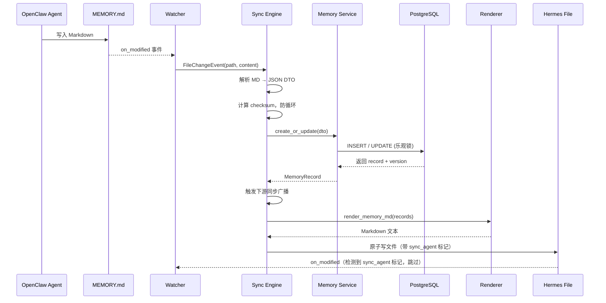
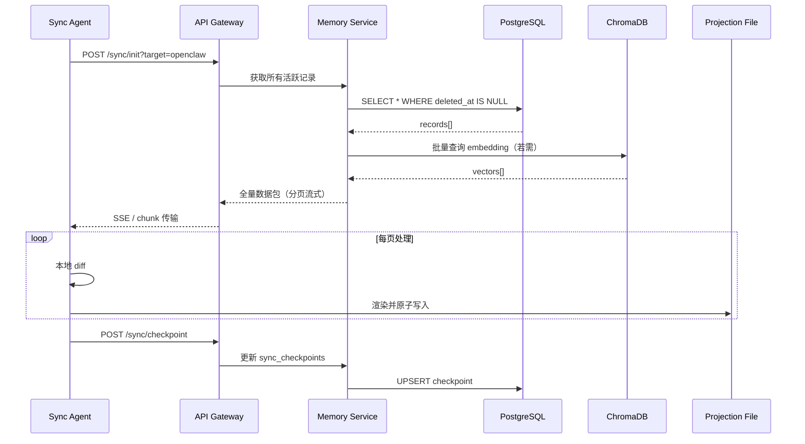
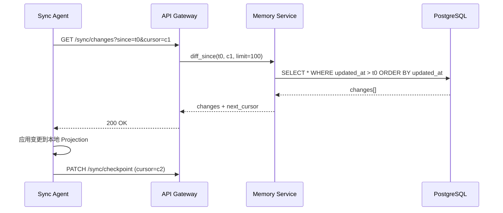

# OpenClaw ↔ Hermes 记忆同步系统设计文档

> 版本：v2.0 完整版  
> 状态：设计阶段 → 可进入开发实施  
> 技术栈：Python / FastAPI / PostgreSQL（或 SQLite）/ Watchdog / ChromaDB / Docker

---

# 一、设计目标

## 1. 核心目标

* OpenClaw 与 Hermes 的 `MEMORY.md`、`USER.md` **同源一致**
* 任一侧修改 → 另一侧可见（准实时）
* 避免冲突覆盖、重复写入、语义污染
* 支持结构化检索与长期演进

---

## 2. 设计原则

1. **单一事实源（SSOT）**

   * 文件不是源头，数据库才是源头

2. **文件仅为“投影（Projection）”**

   * MEMORY.md / USER.md = 渲染结果

3. **结构化优先**

   * Markdown只是展示层

4. **双向同步但单向裁决**

   * 写入统一走 Memory Hub

---

# 二、总体架构

```id="arch1"
        OpenClaw                  Hermes
     (workspace)              (memory system)
        │                          │
        │ 读写文件                 │
        ▼                          ▼
   MEMORY.md / USER.md（镜像层 / Projection）
                │
                │ 文件监听（Watcher）
                ▼
        ┌────────────────────┐
        │   Memory Sync Agent │  ← 核心组件
        └────────┬───────────┘
                 │
                 ▼
        ┌────────────────────┐
        │    Memory Hub       │
        │ (结构化存储中心)    │
        └────────────────────┘
```

---

# 三、核心组件设计

## 1. Memory Hub（唯一数据源）

### 数据结构（统一模型）

```json id="schema1"
{
  "id": "uuid",
  "type": "user_profile | memory | task | preference",
  "content": "用户正在减重计划",
  "source": "openclaw | hermes",
  "tags": ["健康", "减肥"],
  "importance": 0.8,
  "updated_at": "2026-04-20T10:00:00",
  "version": 3
}
```

---

## 2. 文件层（Projection）

### USER.md（用户画像）

结构标准化：

```markdown id="user_md"
# 用户画像

## 基本信息
- 身高：172cm
- 体重：74kg

## 长期目标
- 3个月减至70kg

## 偏好
- 偏向低碳饮食

## 约束
- 高血压、高血脂
```

---

### MEMORY.md（动态记忆）

```markdown id="memory_md"
# 长期记忆

## 重要事项
- 用户正在执行减重计划（2026-03）

## 历史行为
- 曾尝试断食但失败

## 当前任务
- 制定饮食+运动计划
```

---

# 四、同步机制设计（核心）

## 1. 同步模式

采用：

> **“事件驱动 + 文件监听 + API写入”三段式**

---

## 2. 写入路径（统一入口）

### 原则

所有写入必须经过 Memory Hub：

```id="flow1"
Agent → Memory API → DB → 渲染 → 写回文件
```

---

## 3. 文件监听（Watcher）

监听：

```id="watch_paths"
OpenClaw/workspace/*/MEMORY.md
OpenClaw/workspace/*/USER.md
Hermes/memory/*.md
```

工具建议：

* Python watchdog
* 或 Node.js chokidar

---

## 4. 同步流程

### 场景1：OpenClaw 写入 MEMORY.md

```id="flow2"
1. 文件变更触发 watcher
2. 解析 Markdown → 结构化数据
3. 调用 Memory Hub API（update）
4. Hub 更新版本号
5. 通知 Hermes（或其 watcher触发）
6. Hermes 文件重渲染
```

---

### 场景2：Hermes 写入 USER.md

流程同上（反向同步）

---

# 五、Markdown 解析与生成规则

## 1. 解析规则（MD → JSON）

| Markdown 区块 | 映射字段    |
| ----------- | ------- |
| 一级标题        | type    |
| 二级标题        | tags    |
| 列表项         | content |

---

示例：

```markdown id="parse_example"
## 偏好
- 低碳饮食
```

→

```json id="parse_json"
{
  "type": "preference",
  "content": "低碳饮食"
}
```

---

## 2. 渲染规则（JSON → MD）

按优先级输出：

```id="render_order"
用户画像 > 长期目标 > 偏好 > 历史行为
```

---

# 六、冲突解决机制（关键）

## 1. 冲突类型

| 类型   | 示例               |
| ---- | ---------------- |
| 覆盖冲突 | 两边修改同一条          |
| 语义冲突 | “低碳饮食” vs “高碳饮食” |
| 重复写入 | 相同内容多次记录         |

---

## 2. 解决策略

### （1）版本号机制

```json id="versioning"
{
  "version": 3
}
```

规则：

* 新版本覆盖旧版本
* 若版本冲突 → merge

---

### （2）语义去重（embedding）

* 相似度 > 0.9 → 判定重复

---

### （3）优先级策略

| 来源        | 优先级 |
| --------- | --- |
| USER.md   | 高   |
| MEMORY.md | 中   |
| 自动生成      | 低   |

---

# 七、模块划分与接口设计

## 1. 模块拆分

| 模块 | 职责 | 依赖 |
|------|------|------|
| **API Gateway** | 统一入口、路由、认证、限流 | Memory Service |
| **Memory Service** | CRUD、搜索、事务管理 | Sync Engine, DB |
| **Sync Engine** | 版本比对、变更检测、冲突裁决 | Memory Service, Watcher |
| **Watcher** | 文件监听、变更事件生成 | Sync Engine |
| **Renderer** | JSON → Markdown 渲染、格式化 | Memory Service |
| **Conflict Resolver** | 三方合并、语义去重、优先级裁决 | Embedding Service |
| **Embedding Service** | 文本向量化、相似度计算 | ChromaDB |

---

## 2. 模块间接口（Python 伪接口）

```python
# memory_service.py
class MemoryService:
    async def create(self, dto: MemoryCreateDTO) -> MemoryRecord: ...
    async def update(self, id: UUID, dto: MemoryUpdateDTO, expected_version: int) -> MemoryRecord: ...
    async def get(self, id: UUID) -> MemoryRecord: ...
    async def search(self, query: str, top_k: int = 5) -> List[MemoryRecord]: ...
    async def list_since(self, since: datetime, cursor: str | None, limit: int = 50) -> PaginatedResult: ...

# sync_engine.py
class SyncEngine:
    async def apply_change(self, change: FileChangeEvent) -> SyncResult: ...
    async def diff_since(self, checkpoint: datetime) -> List[ChangeEvent]: ...

# conflict_resolver.py
class ConflictResolver:
    async def resolve(self, local: MemoryRecord, remote: MemoryRecord) -> MemoryRecord: ...

# renderer.py
class Renderer:
    def render_user_md(self, records: List[MemoryRecord]) -> str: ...
    def render_memory_md(self, records: List[MemoryRecord]) -> str: ...
    def parse_md(self, text: str) -> List[MemoryCreateDTO]: ...
```

---

# 八、详细数据模型

## 1. 数据库选型

* **默认**：PostgreSQL 14+（生产）
* **轻量**：SQLite（开发 / 单机 MVP）
* **向量存储**：ChromaDB（embedding 检索）

---

## 2. SQLAlchemy 模型定义

```python
# models.py
import uuid
from datetime import datetime
from enum import Enum as PyEnum
from sqlalchemy import (
    Column, String, Float, DateTime, Integer,
    JSON, Index, UniqueConstraint, ForeignKey, func
)
from sqlalchemy.dialects.postgresql import UUID as PGUUID
from sqlalchemy.orm import declarative_base

Base = declarative_base()

class MemoryType(str, PyEnum):
    USER_PROFILE = "user_profile"
    MEMORY = "memory"
    TASK = "task"
    PREFERENCE = "preference"

class MemorySource(str, PyEnum):
    OPENCLAW = "openclaw"
    HERMES = "hermes"
    SYNC_AGENT = "sync_agent"

class MemoryRecord(Base):
    __tablename__ = "memory_records"

    id = Column(PGUUID(as_uuid=True), primary_key=True, default=uuid.uuid4)
    type = Column(String(32), nullable=False, index=True)
    content = Column(String(4000), nullable=False)
    source = Column(String(32), nullable=False, index=True)
    tags = Column(JSON, default=list)
    importance = Column(Float, default=0.5)
    version = Column(Integer, nullable=False, default=1)
    checksum = Column(String(64), nullable=True)
    embedding_id = Column(String(64), nullable=True, index=True)
    created_at = Column(DateTime(timezone=True), server_default=func.now())
    updated_at = Column(DateTime(timezone=True), server_default=func.now(), onupdate=func.now())
    deleted_at = Column(DateTime(timezone=True), nullable=True, index=True)

    __table_args__ = (
        Index("ix_memory_type_importance", "type", "importance"),
        Index("ix_memory_updated_at", "updated_at"),
        Index("ix_memory_tags_gin", "tags"),  # PostgreSQL GIN
    )

class SyncCheckpoint(Base):
    __tablename__ = "sync_checkpoints"

    id = Column(PGUUID(as_uuid=True), primary_key=True, default=uuid.uuid4)
    target = Column(String(64), nullable=False, unique=True)
    last_sync_at = Column(DateTime(timezone=True), nullable=False)
    cursor = Column(String(256), nullable=True)
    status = Column(String(32), default="ok")

class AuditLog(Base):
    __tablename__ = "audit_logs"

    id = Column(PGUUID(as_uuid=True), primary_key=True, default=uuid.uuid4)
    action = Column(String(32), nullable=False, index=True)
    entity_type = Column(String(32), nullable=False)
    entity_id = Column(PGUUID(as_uuid=True), nullable=False, index=True)
    actor = Column(String(128), nullable=False)
    payload = Column(JSON, default=dict)
    ip_address = Column(String(64), nullable=True)
    created_at = Column(DateTime(timezone=True), server_default=func.now())

    __table_args__ = (
        Index("ix_audit_entity", "entity_type", "entity_id"),
        Index("ix_audit_created_at", "created_at"),
    )
```

---

## 3. 索引策略说明

| 索引名 | 字段 | 用途 |
|--------|------|------|
| `ix_memory_type_importance` | type + importance | 按类型筛选 + 优先级排序 |
| `ix_memory_updated_at` | updated_at | 增量同步游标 |
| `ix_memory_tags_gin` | tags (GIN) | 标签搜索 |
| `ix_audit_entity` | entity_type + entity_id | 审计追踪 |

---

# 九、API 接口设计

## 1. 通用约定

* Base URL：`/api/v1`
* Content-Type：`application/json`
* 认证方式：Header `Authorization: Bearer <JWT>` 或 `X-API-Key: <key>`
* 统一错误体：

```json
{
  "error_code": "MEMORY_NOT_FOUND",
  "message": "记忆记录不存在",
  "details": {}
}
```

---

## 2. 记忆 CRUD

### 2.1 创建记忆

```
POST /memories
```

**请求体：**

```json
{
  "type": "memory",
  "content": "用户正在执行减重计划",
  "source": "openclaw",
  "tags": ["健康", "减肥"],
  "importance": 0.85
}
```

**响应 201：**

```json
{
  "id": "550e8400-e29b-41d4-a716-446655440000",
  "type": "memory",
  "content": "用户正在执行减重计划",
  "source": "openclaw",
  "tags": ["健康", "减肥"],
  "importance": 0.85,
  "version": 1,
  "created_at": "2026-04-20T10:00:00Z",
  "updated_at": "2026-04-20T10:00:00Z"
}
```

---

### 2.2 查询记忆（单条）

```
GET /memories/{id}
```

**响应 200：** 同上  
**响应 404：** `MEMORY_NOT_FOUND`

---

### 2.3 更新记忆（乐观锁）

```
PATCH /memories/{id}
```

**请求体：**

```json
{
  "content": "用户已调整减重计划为低碳饮食",
  "importance": 0.9,
  "expected_version": 2
}
```

**响应 200：** 更新后记录  
**响应 409：** `VERSION_CONFLICT`（需客户端 merge 后重试）

---

### 2.4 删除记忆（软删除）

```
DELETE /memories/{id}
```

**响应 204**  
**逻辑：** 设置 `deleted_at`，不影响历史版本

---

### 2.5 列表查询（分页 + 过滤）

```
GET /memories?type=memory&tag=健康&importance_min=0.5&limit=20&cursor=xxx
```

**响应 200：**

```json
{
  "data": [...],
  "next_cursor": "eyJpZCI6Inh4eCJ9",
  "has_more": true
}
```

---

## 3. 批量操作

### 3.1 批量创建 / 更新

```
POST /memories/batch
```

**请求体：**

```json
{
  "items": [
    { "op": "create", "data": {...} },
    { "op": "update", "id": "xxx", "data": {...}, "expected_version": 3 }
  ],
  "atomic": false
}
```

**响应 200：**

```json
{
  "results": [
    { "status": "created", "id": "..." },
    { "status": "conflict", "id": "...", "error_code": "VERSION_CONFLICT" }
  ]
}
```

---

## 4. 搜索检索

### 4.1 全文 + 语义混合搜索

```
GET /memories/search?q=减重计划&top_k=10&hybrid=true
```

**响应 200：**

```json
{
  "results": [
    {
      "record": {...},
      "bm25_score": 1.23,
      "vector_score": 0.91,
      "hybrid_score": 1.07
    }
  ]
}
```

* `hybrid=true`：BM25 + 向量融合排序（RRF）
* `hybrid=false`：仅 BM25 全文

---

### 4.2 标签聚合

```
GET /memories/tags?type=memory
```

**响应：**

```json
{
  "tags": [
    { "name": "健康", "count": 12 },
    { "name": "减肥", "count": 8 }
  ]
}
```

---

## 5. 同步状态查询

### 5.1 获取同步检查点

```
GET /sync/checkpoints
```

**响应：**

```json
{
  "checkpoints": [
    { "target": "openclaw", "last_sync_at": "2026-04-20T10:00:00Z", "status": "ok" },
    { "target": "hermes", "last_sync_at": "2026-04-20T09:58:00Z", "status": "lagged" }
  ]
}
```

---

### 5.2 增量变更拉取

```
GET /sync/changes?since=2026-04-20T09:00:00Z&cursor=&limit=100
```

**响应：**

```json
{
  "changes": [
    { "op": "update", "record": {...}, "previous_version": 2 }
  ],
  "next_cursor": "...",
  "checkpoint": "2026-04-20T10:00:00Z"
}
```

---

## 6. 健康检查

```
GET /health
```

**响应 200：**

```json
{
  "status": "healthy",
  "version": "1.0.0",
  "components": {
    "database": "ok",
    "chroma": "ok",
    "disk": "ok"
  }
}
```

---

# 十、核心流程时序图

## 1. Agent 写入 MEMORY.md 并同步



---

## 2. 全量同步流程



---

## 3. 增量同步流程



---

# 十一、关键实现细节

## 1. Memory Sync Agent（核心服务）

职责：

* 文件监听
* Markdown解析
* API调用
* 冲突处理
* 文件重写

---

## 2. 防循环写入机制（必须）

问题：

```id="loop_problem"
写入 → watcher触发 → 再写入 → 死循环
```

解决：

增加标记：

```json id="flag"
"source": "sync_agent"
```

或：

```id="lock"
写文件前加 lock 标志
```

实际方案（推荐）：

1. **Metadata Header**：文件顶部写入 YAML Front Matter：

```markdown
---
source: sync_agent
written_at: 2026-04-20T10:00:00Z
version: 5
---
```

2. **Watcher 过滤**：检测到 `source: sync_agent` 且 `written_at` 在 5 秒内 → 跳过解析

3. **文件级别锁**：写入前创建 `.MEMORY.md.lock`，完成后删除

---

## 3. 写入节流（Debounce）

* 500ms 内多次修改 → 合并一次

---

# 十二、错误处理与降级策略

## 1. 错误码体系

| 错误码 | HTTP 状态 | 说明 | 客户端处理 |
|--------|-----------|------|------------|
| `MEMORY_NOT_FOUND` | 404 | 记录不存在 | 忽略或重新创建 |
| `VERSION_CONFLICT` | 409 | 乐观锁冲突 | 拉取最新版本，merge 后重试 |
| `VALIDATION_ERROR` | 422 | 参数校验失败 | 修正请求体 |
| `RATE_LIMITED` | 429 | 限流 | 指数退避重试 |
| `SYNC_TARGET_UNAVAILABLE` | 503 | 同步目标离线 | 标记 lagged，队列重试 |
| `EMBEDDING_TIMEOUT` | 504 | 向量服务超时 | 降级为纯文本搜索 |

---

## 2. 重试与补偿机制

* **API 调用**：指数退避（100ms → 200ms → 400ms → ... 最大 5 次）
* **文件写入失败**：写入本地队列（SQLite 队列表），定时重试
* **DB 连接断开**：SQLAlchemy `pool_pre_ping=True`，自动重连
* **网络分区**：同步进入 `lagged` 状态，待恢复后自动补同步（基于 checkpoint）

---

## 3. 降级策略

| 故障场景 | 降级行为 |
|----------|----------|
| ChromaDB 不可用 | 搜索降级为纯 LIKE / BM25 |
| PostgreSQL 主库宕机 | 若配置只读从库，切只读模式；否则本地缓存服务 |
| Sync Agent 崩溃 | 重启后读取 checkpoint，自动补同步 |
| 磁盘满 | 停止写入，报警，保留读取能力 |

---

# 十三、性能设计

## 1. 多级缓存

* **L1**：进程内 LRU（`functools.lru_cache` / `cachetools.TTLCache`）
  * 热点记忆记录（如 USER.md 内容）缓存 60s
* **L2**：Redis（可选）
  * 全局 checkpoint、配置、session
* **L3**：数据库查询结果缓存（SQLAlchemy 二级缓存）

---

## 2. 批量操作优化

* 批量写入使用 `INSERT ... ON CONFLICT`（PostgreSQL UPSERT）
* 批量更新使用 `executemany`
* 批量 embedding 推理使用队列 + 异步 worker

---

## 3. 分页游标

* 拒绝 `OFFSET` 深分页，采用 **Keyset Pagination**
* 游标编码：`base64(json({"updated_at": "...", "id": "..."}))`

---

## 4. 异步任务队列

* 使用 `celery` 或 `arq`（推荐，基于 Redis）处理：
  * Embedding 生成（CPU 密集型，可异步化）
  * 全量同步渲染
  * 审计日志写入（异步落盘，降低 API 延迟）

---

## 5. Embedding 异步化

```python
# 伪代码
@task(queue="embedding")
async def generate_embedding(record_id: UUID):
    record = await memory_service.get(record_id)
    vector = await embedding_service.encode(record.content)
    await chroma_collection.upsert(ids=[str(record_id)], embeddings=[vector])
    await memory_service.update_embedding_id(record_id, embedding_id=str(record_id))
```

* 创建记录时仅写入 DB，触发后台任务生成向量
* 搜索时若向量未就绪，降级为 BM25

---

# 十四、安全设计

## 1. 认证与鉴权

* **API Key**：服务间调用（Sync Agent ↔ Memory Hub）使用预共享 `X-API-Key`
* **JWT**：用户 / Agent 身份，短有效期（15min），Refresh Token（7天）
* **RBAC 简化角色**：
  * `admin`：全部权限
  * `agent`：读写记忆、触发同步
  * `reader`：只读

---

## 2. 输入校验与防注入

* FastAPI `Pydantic` 严格校验所有入参
* SQL 全部使用 SQLAlchemy ORM / 参数化查询，禁止字符串拼接
* Markdown 解析前做长度限制（单条 content ≤ 4000 字符）
* 标签白名单：只允许 `[a-zA-Z0-9\u4e00-\u9fa5_-]{1,32}`

---

## 3. 敏感数据加密

* **传输层**：TLS 1.3（生产部署强制）
* **存储层**：
  * `content` 若含敏感信息（如手机号、密码），使用 AES-256-GCM 加密存储
  * 加密密钥由环境变量 `MEMORY_ENCRYPTION_KEY` 提供，启动时加载
* **审计日志**：记录所有写操作，保留 180 天

---

## 4. 审计日志

```json
{
  "id": "...",
  "action": "update",
  "entity_type": "memory",
  "entity_id": "550e8400-...",
  "actor": "openclaw-agent-01",
  "ip_address": "127.0.0.1",
  "payload": { "changed_fields": ["content", "importance"] },
  "created_at": "2026-04-20T10:00:00Z"
}
```

* 写入 `audit_logs` 表
* 敏感 payload 可配置脱敏规则

---

# 十五、部署架构

## 1. Docker / Docker Compose（推荐）

```yaml
# docker-compose.yml
version: "3.9"
services:
  hub:
    build: ./hub
    ports:
      - "8000:8000"
    environment:
      - DATABASE_URL=postgresql://user:pass@db:5432/memory
      - CHROMA_HOST=chromadb
      - API_KEY=${MEMORY_API_KEY}
      - JWT_SECRET=${JWT_SECRET}
    volumes:
      - ./config:/app/config:ro
      - hub_logs:/app/logs
    depends_on:
      - db
      - chromadb
    restart: unless-stopped

  sync-agent:
    build: ./sync-agent
    environment:
      - HUB_URL=http://hub:8000
      - API_KEY=${MEMORY_API_KEY}
      - WATCH_PATHS=/data/openclaw/workspace,/data/hermes/memory
    volumes:
      - /home/user/openclaw/workspace:/data/openclaw/workspace:rw
      - /home/user/hermes/memory:/data/hermes/memory:rw
      - sync_state:/app/state
    depends_on:
      - hub
    restart: unless-stopped

  db:
    image: postgres:15-alpine
    environment:
      - POSTGRES_DB=memory
      - POSTGRES_USER=user
      - POSTGRES_PASSWORD=${DB_PASSWORD}
    volumes:
      - postgres_data:/var/lib/postgresql/data
    restart: unless-stopped

  chromadb:
    image: chromadb/chroma:latest
    volumes:
      - chroma_data:/chroma/chroma
    restart: unless-stopped

volumes:
  postgres_data:
  chroma_data:
  hub_logs:
  sync_state:
```

---

## 2. 环境隔离

| 环境 | 数据库 | 文件路径 | 说明 |
|------|--------|----------|------|
| `dev` | SQLite | `./tmp/dev_data` | 本地开发，一键启动 |
| `test` | SQLite (内存) | `./tmp/test_data` | CI 自动化测试 |
| `staging` | PostgreSQL | 测试目录 | 预发布验证 |
| `prod` | PostgreSQL + 备份 | 生产目录 | 高可用部署 |

---

## 3. 配置外置化

使用 Pydantic Settings + `.env` 文件：

```python
# config.py
from pydantic_settings import BaseSettings

class Settings(BaseSettings):
    env: str = "dev"
    database_url: str = "sqlite+aiosqlite:///./memory.db"
    chroma_host: str = "localhost"
    chroma_port: int = 8000
    api_key: str = "dev-key"
    jwt_secret: str = "dev-secret"
    log_level: str = "INFO"
    sync_debounce_ms: int = 500
    embedding_model: str = "sentence-transformers/all-MiniLM-L6-v2"

    class Config:
        env_file = ".env"
        env_file_encoding = "utf-8"
```

---

## 4. 持久化卷

* `postgres_data`：结构化数据
* `chroma_data`：向量索引
* `hub_logs`：服务日志
* `sync_state`：Sync Agent 本地状态 / 队列

---

# 十六、测试策略

## 1. 单元测试（pytest）

覆盖范围：

* **Renderer**：MD ↔ JSON 双向解析（边界：空列表、特殊字符、多级标题）
* **Conflict Resolver**：版本冲突、语义合并、优先级裁决
* **Memory Service**：CRUD、乐观锁、软删除

Mock 策略：

* DB → `pytest-asyncio` + `AsyncMock` + 内存 SQLite
* ChromaDB → `unittest.mock.MagicMock`
* File Watcher → 手动触发事件函数

---

## 2. 集成测试

* **API 层**：`httpx.AsyncClient` + `TestClient` 测试完整请求链路
* **DB 迁移**：Alembic 升级 / 降级回滚测试
* **Sync 流程**：启动真实 Watcher，临时目录中修改文件，验证 API 是否收到正确事件

---

## 3. E2E 测试

```bash
# 启动完整环境
docker compose -f docker-compose.test.yml up --build --abort-on-container-exit
```

测试场景：

1. OpenClaw 写入 `MEMORY.md` → 验证 Hermes 侧文件内容一致性（10s 内）
2. 同时修改同一记忆 → 验证冲突解决后最终一致性
3. 断网恢复 → 验证 lagged 状态解除与补同步

---

## 4. CI 流水线（GitHub Actions 示例）

```yaml
# .github/workflows/ci.yml
name: CI
on: [push, pull_request]
jobs:
  test:
    runs-on: ubuntu-latest
    steps:
      - uses: actions/checkout@v4
      - uses: actions/setup-python@v5
        with:
          python-version: "3.11"
      - run: pip install -r requirements-dev.txt
      - run: pytest tests/unit --cov=src --cov-report=xml
      - run: pytest tests/integration
      - run: docker compose -f docker-compose.test.yml up --build --abort-on-container-exit
```

---

# 十七、监控与可观测性

## 1. 核心指标（Metrics）

| 指标名 | 类型 | 说明 |
|--------|------|------|
| `memory_api_request_duration_seconds` | Histogram | API 延迟 |
| `memory_api_requests_total` | Counter | 请求总量（按状态码、路径） |
| `sync_lag_seconds` | Gauge | 各目标同步延迟 |
| `sync_conflicts_total` | Counter | 冲突次数 |
| `embedding_queue_length` | Gauge | Embedding 待处理队列长度 |
| `db_connection_pool_usage` | Gauge | 连接池使用率 |

* 使用 `prometheus-fastapi-instrumentator` 暴露 `/metrics`

---

## 2. 结构化日志

```json
{
  "timestamp": "2026-04-20T10:00:00.123Z",
  "level": "INFO",
  "logger": "memory_hub.api",
  "message": "memory updated",
  "trace_id": "abc123",
  "span_id": "def456",
  "fields": {
    "memory_id": "550e8400-...",
    "source": "openclaw",
    "version": 4,
    "duration_ms": 12
  }
}
```

* 使用 `structlog` + `python-json-logger`
* 开发环境输出彩色文本，生产环境输出 JSON

---

## 3. 分布式追踪（Trace ID）

* 每个 HTTP 请求生成 `X-Trace-ID`（UUID）
* Trace ID 贯穿：API Gateway → Memory Service → DB / ChromaDB → Sync Agent → File Watcher
* 使用 `opentelemetry-python` 接入 Jaeger（可选）

---

## 4. 告警规则（Prometheus Alertmanager）

```yaml
groups:
  - name: memory_alerts
    rules:
      - alert: SyncLagHigh
        expr: sync_lag_seconds > 300
        for: 2m
        annotations:
          summary: "同步延迟超过 5 分钟"
      - alert: APIErrorRateHigh
        expr: rate(memory_api_requests_total{status=~"5.."}[5m]) > 0.1
        for: 1m
        annotations:
          summary: "API 5xx 错误率过高"
      - alert: DBConnectionsExhausted
        expr: db_connection_pool_usage > 0.9
        for: 30s
        annotations:
          summary: "数据库连接池耗尽"
```

---

# 十八、数据备份与迁移

## 1. 备份策略

| 层级 | 策略 | 工具 |
|------|------|------|
| PostgreSQL | 每日全量备份 + WAL 归档 | `pg_dump` + `pg_basebackup` |
| ChromaDB | 每周快照 + 实时复制（若集群） | 文件系统快照 |
| 文件 Projection | Git 版本控制（可选） | `git` 自动 commit |

备份保留：

* 每日快照保留 7 天
* 每周快照保留 4 周
* 每月快照保留 12 个月

---

## 2. Schema 迁移（Alembic）

```bash
# 初始化
alembic init migrations

# 生成迁移脚本
alembic revision --autogenerate -m "add audit_logs"

# 升级
alembic upgrade head

# 降级
alembic downgrade -1
```

* 所有表结构变更必须通过 Alembic 脚本
* CI 中运行 `alembic check` 确保模型与迁移同步

---

## 3. 灾难恢复（DR）

| 故障 | RTO | RPO | 恢复步骤 |
|------|-----|-----|----------|
| 单表误删 | 5min | 0 | 从备份恢复单表 |
| 数据库损坏 | 30min | < 1h | 切换备份实例，重放 WAL |
| 全实例丢失 | 2h | < 24h | 异地备份还原，补同步 |
| Sync Agent 状态丢失 | 5min | 上次 checkpoint | 从 `/sync/checkpoints` 重新拉取 |

---

# 十九、开发里程碑与任务拆分

## Milestone 1：MVP（第 1-2 周）

目标：USER.md 单向同步可运行

* [ ] 搭建 FastAPI 项目骨架（目录、配置、日志）
* [ ] Memory Service CRUD + SQLite 存储
* [ ] Markdown Renderer（USER.md 渲染）
* [ ] Watchdog 文件监听 + 解析
* [ ] Sync Agent 写入 Hub + 回写文件
* [ ] 防循环写入（YAML Front Matter 标记）
* [ ] Docker Compose 一键启动

**验收标准**：修改 `USER.md` → 10s 内 Hub 数据更新 → 另一侧文件渲染一致

---

## Milestone 2：双向同步 + 冲突解决（第 3-4 周）

* [ ] 支持 MEMORY.md 同步
* [ ] 乐观锁版本控制
* [ ] 冲突检测与三方合并
* [ ] 增量同步 API（`/sync/changes`）
* [ ] Checkpoint 持久化
* [ ] 写入 Debounce（500ms）

**验收标准**：两侧同时修改不同记忆 → 无冲突；修改同一条 → 正确合并或提示

---

## Milestone 3：搜索与向量化（第 5-6 周）

* [ ] 集成 ChromaDB
* [ ] Embedding Service（异步任务）
* [ ] 混合搜索 API（BM25 + 向量）
* [ ] 标签聚合与过滤
* [ ] 批量操作 API
* [ ] 分页游标优化

**验收标准**：搜索“减重计划”返回相关记忆 Top 5 准确率 > 90%

---

## Milestone 4：安全、监控与生产就绪（第 7-8 周）

* [ ] API Key + JWT 认证
* [ ] 审计日志
* [ ] Prometheus 指标 + `/metrics`
* [ ] 结构化日志 + Trace ID
* [ ] 告警规则
* [ ] PostgreSQL 迁移支持
* [ ] 数据备份脚本
* [ ] 完整 E2E 测试覆盖

**验收标准**：通过安全审计、压测 100 QPS 稳定、故障注入测试通过

---

## 任务拆分建议（看板）

| 模块 | 任务 | 估时 | 优先级 |
|------|------|------|--------|
| API | 记忆 CRUD + 乐观锁 | 2d | P0 |
| API | 批量操作 + 搜索 | 2d | P1 |
| API | 同步状态 + 健康检查 | 1d | P1 |
| Data | SQLAlchemy 模型 + Alembic | 1.5d | P0 |
| Data | ChromaDB 集成 | 1.5d | P1 |
| Sync | Watchdog 监听 | 1d | P0 |
| Sync | 增量同步 + Checkpoint | 2d | P1 |
| Render | MD 解析与生成 | 1.5d | P0 |
| Render | 防循环 + Debounce | 1d | P0 |
| Security | 认证 + 审计日志 | 2d | P1 |
| Ops | Docker + CI + 监控 | 2d | P1 |

---

# 二十、风险与边界

## 1. 不建议做的事

* ❌ 直接 rsync 两个文件
* ❌ Git 同步（冲突不可控）
* ❌ 仅靠文本 diff

---

## 2. 潜在问题

* Agent 写入风格差异
* 记忆膨胀
* 低质量信息污染

---

# 二十一、本质总结

这是一个典型的：

> **“多 Agent 共享状态一致性问题”**

对应经典解法：

* 数据中心化（Memory Hub）
* 视图外化（Markdown）
* 同步事件化（Watcher + API）

---

> 本文档覆盖设计、API、模型、模块、时序、性能、安全、部署、测试、监控、备份、里程碑全链路，可直接作为开发实施的依据。
