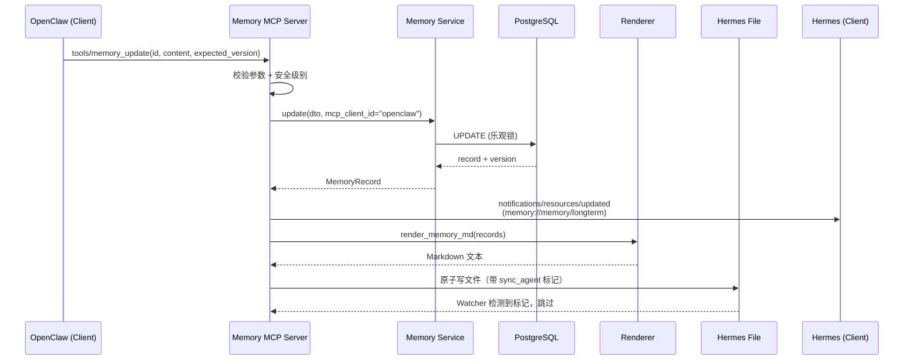
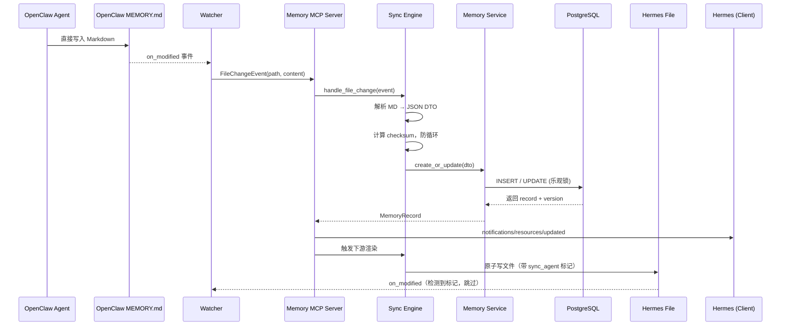
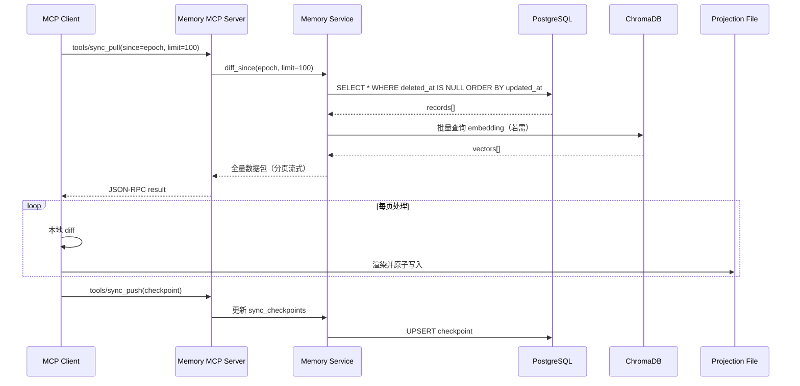
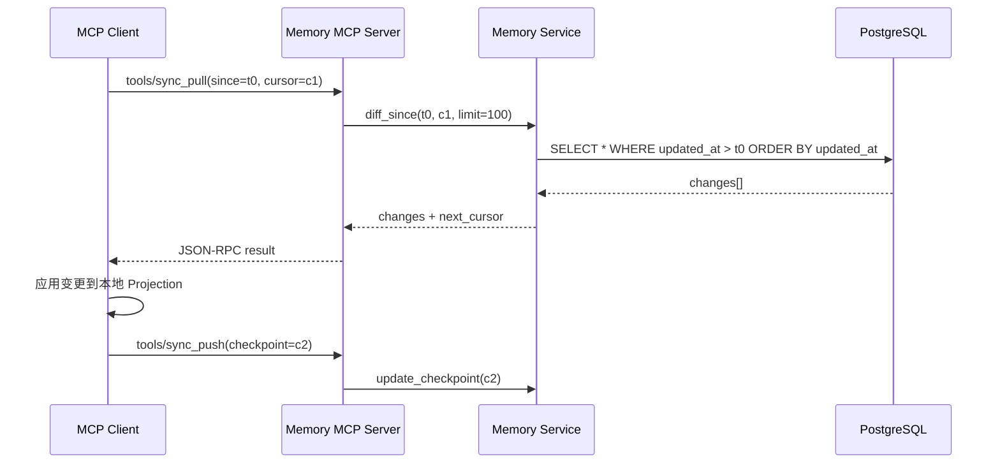

# OpenClaw ↔ Hermes 记忆同步系统设计文档

> 版本：v3.0 MCP 版  
> 状态：设计阶段 → 可进入开发实施  
> 技术栈：Python / FastMCP / mcp-python-sdk / PostgreSQL（或 SQLite）/ Watchdog / ChromaDB / Docker / uvicorn

---

# 一、设计目标

## 1. 核心目标

* OpenClaw 与 Hermes 的 `MEMORY.md`、`USER.md` **同源一致**
* 任一侧修改 → 另一侧可见（准实时）
* 避免冲突覆盖、重复写入、语义污染
* 支持结构化检索与长期演进

---

## 2. 设计原则

1. **单一事实源（SSOT）**

   * 文件不是源头，数据库才是源头

2. **文件仅为“投影（Projection）”**

   * MEMORY.md / USER.md = 渲染结果

3. **结构化优先**

   * Markdown只是展示层

4. **双向同步但单向裁决**

   * 写入统一走 Memory Hub（通过 MCP Tools）

---

# 二、总体架构

```id="arch_mcp"
        OpenClaw (MCP Client)          Hermes (MCP Client)
     (workspace)                        (memory system)
             │                              │
             │ stdio / sse                  │ stdio / sse
             ▼                              ▼
    ┌──────────────────────────────────────────────────────────────┐
    │           Memory MCP Server（本地进程）                       │
    │  ┌───────────────────────────────────────────────────────┐  │
    │  │  MCP Transport Layer（stdio 主 / sse 备选）            │  │
    │  │  MCP Protocol Handler                                  │  │
    │  │  Tools / Resources / Prompts / Sampling                │  │
    │  └──────────────────────────┬────────────────────────────┘  │
    │                             │                                │
    │  ┌──────────────────────────▼────────────────────────────┐  │
    │  │    Memory Core Service                                 │  │
    │  │  - CRUD / Search / Sync                                │  │
    │  │  - Conflict Resolver                                   │  │
    │  │  - Embedding Service                                   │  │
    │  └──────────────────────────┬────────────────────────────┘  │
    │                             │                                │
    │  ┌──────────────────────────▼────────────────────────────┐  │
    │  │    Storage Layer                                       │  │
    │  │  PostgreSQL / SQLite                                   │  │
    │  │  ChromaDB (vector)                                     │  │
    │  └───────────────────────────────────────────────────────┘  │
    └──────────────────────────────────────────────────────────────┘
                         │
                         ▼
              MEMORY.md / USER.md（Projection）
```

## 架构角色说明

| 角色 | 实体 | 职责 |
|------|------|------|
| **MCP Client** | OpenClaw / Hermes | 通过 MCP 协议调用 Tools、读取 Resources、接收 Notifications |
| **MCP Server** | Memory MCP Server | 本地进程，承载 Memory Core Service，暴露 Tools / Resources / Prompts |
| **Transport** | stdio / sse | stdio 为主（本地进程管道），sse 为备选（跨网络） |
| **Projection** | MEMORY.md / USER.md | 文件仍然是投影，但 Client 优先通过 MCP Resource 读取 |

---

# 三、核心组件设计

## 1. Memory Hub（唯一数据源）

### 数据结构（统一模型）

```json id="schema1"
{
  "id": "uuid",
  "type": "user_profile | memory | task | preference",
  "content": "用户正在减重计划",
  "source": "openclaw | hermes",
  "tags": ["健康", "减肥"],
  "importance": 0.8,
  "updated_at": "2026-04-20T10:00:00",
  "version": 3
}
```

---

## 2. MCP Server 组件

基于 `mcp.server.Server` 或 `FastMCP` 构建，职责包括：

* **Tools 注册与管理**：暴露记忆 CRUD、搜索、同步、冲突解决等 Tool
* **Resources 注册与管理**：暴露 USER.md / MEMORY.md 内容、同步状态、配置模式等 Resource
* **Prompts 注册与管理**：提供记忆同步提示词、冲突解决提示词
* **Sampling 请求**：当 Embedding Service 或 Conflict Resolver 需要 LLM 辅助时，向 Client 发起采样请求
* **Notification 推送**：数据变更时，向订阅的 Client 推送通知
* **Capability Negotiation**：初始化时与 Client 协商支持的能力

技术选型：

* `FastMCP`（推荐）：声明式、Pythonic 的 MCP Server 框架
* `mcp-python-sdk`：底层协议实现
* `uvicorn`：sse transport 时的 ASGI 服务器

---

## 3. MCP Transport Layer

| Transport | 适用场景 | 配置方式 |
|-----------|----------|----------|
| **stdio**（默认） | 本地同一机器，Client 启动 Server 子进程 | Client 配置 `command` 字段 |
| **sse** | 跨网络、Docker 容器、远程部署 | Client 配置 `url` 字段 |

stdio 模式工作流程：

1. Client（如 OpenClaw）启动 Memory MCP Server 作为子进程
2. 通过 stdin 发送 JSON-RPC 请求，通过 stdout 接收响应
3. Server 进程生命周期由 Client 管理

---

## 4. Sync Agent（MCP Server 内部模块）

不再是独立进程，而是 MCP Server 内部的 **Sync Module**：

* 负责 Projection 文件的渲染与解析
* 接收 MCP Server 内部事件（如 `handle_file_change`）
* 调用 Memory Core Service 进行数据同步
* 管理 Checkpoint 与增量同步状态

---

## 5. Watcher（文件监听）

Watcher 仍然存在，但行为改变：

* 监听 `MEMORY.md` / `USER.md` 文件变更
* **不再直接触发 API**，而是触发 MCP Server 内部的 `handle_file_change` 事件
* 事件进入 Sync Module 的处理队列，经防抖后统一处理
* 检测到 `source: sync_agent` 标记时跳过，防止循环

工具建议：

* Python `watchdog`

---

## 6. 文件层（Projection）

### USER.md（用户画像）

结构标准化：

```markdown id="user_md"
# 用户画像

## 基本信息
- 身高：172cm
- 体重：74kg

## 长期目标
- 3个月减至70kg

## 偏好
- 偏向低碳饮食

## 约束
- 高血压、高血脂
```

---

### MEMORY.md（动态记忆）

```markdown id="memory_md"
# 长期记忆

## 重要事项
- 用户正在执行减重计划（2026-03）

## 历史行为
- 曾尝试断食但失败

## 当前任务
- 制定饮食+运动计划
```

---

# 四、同步机制设计（核心）

## 1. 同步模式

采用：

> **“MCP 协议驱动的状态同步”**

---

## 2. 写入路径（统一入口）

### 原则

所有写入必须经过 MCP Server 的 Tools：

```id="flow_mcp_write"
Agent → MCP Client → call tools/memory_create or tools/memory_update → DB → 渲染 → 写回文件
```

Client 也可以直接修改文件，Watcher 监听到后会触发同步，但**推荐方式**是通过 Tool 调用写入。

---

## 3. 读取路径

Client 读取记忆有两种方式：

1. **推荐**：通过 MCP Resource 读取
   * `resources/memory://memory/longterm` → MEMORY.md 内容
   * `resources/memory://user/profile` → USER.md 内容
2. **兼容**：直接读取本地文件（文件仍是 Projection）

---

## 4. 文件监听（Watcher）

监听：

```id="watch_paths"
OpenClaw/workspace/*/MEMORY.md
OpenClaw/workspace/*/USER.md
Hermes/memory/*.md
```

行为变更：

* Watcher 检测到变更 → 生成 `FileChangeEvent` → 发送到 MCP Server 内部事件总线
* Sync Module 消费事件 → 解析 Markdown → 调用 Memory Core Service
* 不再直接调用 RESTful API

---

## 5. 同步流程

### 场景1：OpenClaw 通过 Tool 写入记忆

```id="flow_mcp_tool"
1. OpenClaw (MCP Client) 调用 tools/memory_update
2. MCP Server 解析参数，校验 schema
3. Memory Core Service 更新 DB（乐观锁）
4. 触发 notification: 向订阅的 Client（Hermes）推送变更通知
5. Sync Module 渲染 Markdown
6. 原子写入 Hermes 的 MEMORY.md（带 sync_agent 标记）
7. Hermes Watcher 检测到标记，跳过解析
```

---

### 场景2：OpenClaw 直接写入 MEMORY.md

```id="flow_mcp_file"
1. OpenClaw 直接修改 MEMORY.md
2. Watcher 检测到文件变更（无 sync_agent 标记）
3. Sync Module 解析 Markdown → 结构化数据
4. Memory Core Service 更新 DB
5. 触发 notification 给 Hermes
6. Hermes 文件重渲染（带 sync_agent 标记）
```

---

### 场景3：Hermes 通过 Resource 读取最新状态

```id="flow_mcp_resource"
1. Hermes (MCP Client) 读取 resources/memory://user/profile
2. MCP Server 从 DB 查询最新数据
3. Renderer 实时生成 Markdown 内容
4. 通过 Resource 响应返回
```

---

## 6. 主动通知机制（Subscription）

当数据变更时，MCP Server 通过 `notifications/resources/updated` 向订阅的 Client 推送：

```json
{
  "method": "notifications/resources/updated",
  "params": {
    "uri": "memory://memory/longterm"
  }
}
```

Client 收到通知后，可选择：

* 重新读取 Resource 获取最新内容
* 忽略（若当前未使用该 Resource）

推送优化：

* Debounce：500ms 窗口期合并多次变更
* 批量推送：一次 JSON-RPC batch 推送多个 Resource URI 变更

---

# 五、Markdown 解析与生成规则

## 1. 解析规则（MD → JSON）

| Markdown 区块 | 映射字段    |
| ----------- | ------- |
| 一级标题        | type    |
| 二级标题        | tags    |
| 列表项         | content |

---

示例：

```markdown id="parse_example"
## 偏好
- 低碳饮食
```

→

```json id="parse_json"
{
  "type": "preference",
  "content": "低碳饮食"
}
```

---

## 2. 渲染规则（JSON → MD）

按优先级输出：

```id="render_order"
用户画像 > 长期目标 > 偏好 > 历史行为
```

---

# 六、冲突解决机制（关键）

## 1. 冲突类型

| 类型   | 示例               |
| ---- | ---------------- |
| 覆盖冲突 | 两边修改同一条          |
| 语义冲突 | “低碳饮食” vs “高碳饮食” |
| 重复写入 | 相同内容多次记录         |

---

## 2. 解决策略

### （1）版本号机制

```json id="versioning"
{
  "version": 3
}
```

规则：

* 新版本覆盖旧版本
* 若版本冲突 → merge

---

### （2）语义去重（embedding）

* 相似度 > 0.9 → 判定重复

---

### （3）优先级策略

| 来源        | 优先级 |
| --------- | --- |
| USER.md   | 高   |
| MEMORY.md | 中   |
| 自动生成      | 低   |

---

# 七、模块划分与接口设计

## 1. 模块拆分

| 模块 | 职责 | 依赖 |
|------|------|------|
| **MCP Server** | Transport 管理、协议处理、Tools/Resources/Prompts 注册 | Memory Service, Sync Engine |
| **MCP Transport** | stdio / sse 连接生命周期管理、JSON-RPC 编解码 | MCP Server |
| **Memory Service** | CRUD、搜索、事务管理 | Sync Engine, DB |
| **Sync Engine** | 版本比对、变更检测、冲突裁决、Projection 渲染 | Memory Service, Watcher |
| **Watcher** | 文件监听、变更事件生成 | Sync Engine |
| **Renderer** | JSON → Markdown 渲染、格式化 | Memory Service |
| **Conflict Resolver** | 三方合并、语义去重、优先级裁决 | Embedding Service |
| **Embedding Service** | 文本向量化、相似度计算 | ChromaDB |

---

## 2. 模块间接口（Python 伪接口）

```python
# mcp_server.py
class MemoryMCPServer:
    def __init__(self, memory_service: MemoryService, sync_engine: SyncEngine):
        self.server = FastMCP("memory-hub")
        self._register_tools()
        self._register_resources()
        self._register_prompts()

    def _register_tools(self):
        @self.server.tool()
        async def memory_create(dto: MemoryCreateDTO) -> MemoryRecord: ...
        @self.server.tool()
        async def memory_update(id: UUID, dto: MemoryUpdateDTO, expected_version: int) -> MemoryRecord: ...
        @self.server.tool()
        async def memory_get(id: UUID) -> MemoryRecord: ...
        @self.server.tool()
        async def memory_search(query: str, top_k: int = 5) -> List[MemoryRecord]: ...
        @self.server.tool()
        async def memory_batch(items: List[BatchItemDTO], atomic: bool = False) -> BatchResult: ...
        @self.server.tool()
        async def sync_pull(since: datetime, cursor: str | None, limit: int = 50) -> PaginatedResult: ...
        @self.server.tool()
        async def sync_push(changes: List[ChangeEvent]) -> SyncResult: ...
        @self.server.tool()
        async def conflict_resolve(local_id: UUID, remote_id: UUID, strategy: str = "merge") -> MemoryRecord: ...

    def _register_resources(self):
        @self.server.resource("memory://user/profile")
        async def get_user_profile() -> str: ...
        @self.server.resource("memory://memory/longterm")
        async def get_memory_longterm() -> str: ...
        @self.server.resource("memory://sync/status")
        async def get_sync_status() -> dict: ...
        @self.server.resource("memory://config/schema")
        async def get_config_schema() -> dict: ...

    def _register_prompts(self):
        @self.server.prompt()
        async def memory_sync_prompt() -> str: ...
        @self.server.prompt()
        async def memory_conflict_prompt() -> str: ...

    async def run_stdio(self):
        await self.server.run_stdio_async()

# memory_service.py
class MemoryService:
    async def create(self, dto: MemoryCreateDTO, mcp_client_id: str, mcp_session_id: str) -> MemoryRecord: ...
    async def update(self, id: UUID, dto: MemoryUpdateDTO, expected_version: int, mcp_client_id: str) -> MemoryRecord: ...
    async def get(self, id: UUID) -> MemoryRecord: ...
    async def search(self, query: str, top_k: int = 5) -> List[MemoryRecord]: ...
    async def list_since(self, since: datetime, cursor: str | None, limit: int = 50) -> PaginatedResult: ...

# sync_engine.py
class SyncEngine:
    async def apply_change(self, change: FileChangeEvent) -> SyncResult: ...
    async def diff_since(self, checkpoint: datetime) -> List[ChangeEvent]: ...

# conflict_resolver.py
class ConflictResolver:
    async def resolve(self, local: MemoryRecord, remote: MemoryRecord) -> MemoryRecord: ...

# renderer.py
class Renderer:
    def render_user_md(self, records: List[MemoryRecord]) -> str: ...
    def render_memory_md(self, records: List[MemoryRecord]) -> str: ...
    def parse_md(self, text: str) -> List[MemoryCreateDTO]: ...
```

---

# 八、详细数据模型

## 1. 数据库选型

* **默认**：PostgreSQL 14+（生产）
* **轻量**：SQLite（开发 / 单机 MVP）
* **向量存储**：ChromaDB（embedding 检索）

---

## 2. SQLAlchemy 模型定义

```python
# models.py
import uuid
from datetime import datetime
from enum import Enum as PyEnum
from sqlalchemy import (
    Column, String, Float, DateTime, Integer,
    JSON, Index, UniqueConstraint, ForeignKey, func
)
from sqlalchemy.dialects.postgresql import UUID as PGUUID
from sqlalchemy.orm import declarative_base

Base = declarative_base()

class MemoryType(str, PyEnum):
    USER_PROFILE = "user_profile"
    MEMORY = "memory"
    TASK = "task"
    PREFERENCE = "preference"

class MemorySource(str, PyEnum):
    OPENCLAW = "openclaw"
    HERMES = "hermes"
    SYNC_AGENT = "sync_agent"

class MemoryRecord(Base):
    __tablename__ = "memory_records"

    id = Column(PGUUID(as_uuid=True), primary_key=True, default=uuid.uuid4)
    type = Column(String(32), nullable=False, index=True)
    content = Column(String(4000), nullable=False)
    source = Column(String(32), nullable=False, index=True)
    tags = Column(JSON, default=list)
    importance = Column(Float, default=0.5)
    version = Column(Integer, nullable=False, default=1)
    checksum = Column(String(64), nullable=True)
    embedding_id = Column(String(64), nullable=True, index=True)
    # MCP 追踪字段
    mcp_client_id = Column(String(64), nullable=True, index=True)
    mcp_session_id = Column(String(128), nullable=True, index=True)
    created_at = Column(DateTime(timezone=True), server_default=func.now())
    updated_at = Column(DateTime(timezone=True), server_default=func.now(), onupdate=func.now())
    deleted_at = Column(DateTime(timezone=True), nullable=True, index=True)

    __table_args__ = (
        Index("ix_memory_type_importance", "type", "importance"),
        Index("ix_memory_updated_at", "updated_at"),
        Index("ix_memory_tags_gin", "tags"),  # PostgreSQL GIN
        Index("ix_memory_mcp_client", "mcp_client_id", "updated_at"),
    )

class SyncCheckpoint(Base):
    __tablename__ = "sync_checkpoints"

    id = Column(PGUUID(as_uuid=True), primary_key=True, default=uuid.uuid4)
    target = Column(String(64), nullable=False, unique=True)
    last_sync_at = Column(DateTime(timezone=True), nullable=False)
    cursor = Column(String(256), nullable=True)
    status = Column(String(32), default="ok")

class AuditLog(Base):
    __tablename__ = "audit_logs"

    id = Column(PGUUID(as_uuid=True), primary_key=True, default=uuid.uuid4)
    action = Column(String(32), nullable=False, index=True)
    entity_type = Column(String(32), nullable=False)
    entity_id = Column(PGUUID(as_uuid=True), nullable=False, index=True)
    actor = Column(String(128), nullable=False)
    mcp_client_id = Column(String(64), nullable=True, index=True)
    mcp_session_id = Column(String(128), nullable=True, index=True)
    payload = Column(JSON, default=dict)
    ip_address = Column(String(64), nullable=True)
    created_at = Column(DateTime(timezone=True), server_default=func.now())

    __table_args__ = (
        Index("ix_audit_entity", "entity_type", "entity_id"),
        Index("ix_audit_created_at", "created_at"),
    )
```

---

## 3. 索引策略说明

| 索引名 | 字段 | 用途 |
|--------|------|------|
| `ix_memory_type_importance` | type + importance | 按类型筛选 + 优先级排序 |
| `ix_memory_updated_at` | updated_at | 增量同步游标 |
| `ix_memory_tags_gin` | tags (GIN) | 标签搜索 |
| `ix_memory_mcp_client` | mcp_client_id + updated_at | 按 Client 溯源与增量拉取 |
| `ix_audit_entity` | entity_type + entity_id | 审计追踪 |

---

# 九、MCP 协议设计

## 1. 通用约定

* **Server Name**：`memory-hub`
* **Protocol Version**：遵循 MCP 2024-11-05 规范
* **Transport**：stdio（默认）/ sse（备选）
* **Error Format**：遵循 JSON-RPC 2.0 错误码规范

```json
{
  "jsonrpc": "2.0",
  "id": 42,
  "error": {
    "code": -32602,
    "message": "Invalid params: expected_version mismatch",
    "data": { "error_code": "VERSION_CONFLICT" }
  }
}
```

---

## 2. Tools 定义

### 2.1 `memory_create` — 创建记忆

**描述**：创建一条新的记忆记录

**输入 Schema**：

```json
{
  "type": "object",
  "properties": {
    "type": { "type": "string", "enum": ["user_profile", "memory", "task", "preference"] },
    "content": { "type": "string", "maxLength": 4000 },
    "tags": { "type": "array", "items": { "type": "string" } },
    "importance": { "type": "number", "minimum": 0, "maximum": 1 },
    "source": { "type": "string", "enum": ["openclaw", "hermes", "sync_agent"] }
  },
  "required": ["type", "content", "source"]
}
```

**输出 Schema**：

```json
{
  "type": "object",
  "properties": {
    "id": { "type": "string", "format": "uuid" },
    "type": { "type": "string" },
    "content": { "type": "string" },
    "source": { "type": "string" },
    "tags": { "type": "array", "items": { "type": "string" } },
    "importance": { "type": "number" },
    "version": { "type": "integer" },
    "created_at": { "type": "string", "format": "date-time" },
    "updated_at": { "type": "string", "format": "date-time" }
  }
}
```

**安全级别**：`agent`（需 Client 具备 agent 角色）

---

### 2.2 `memory_update` — 更新记忆（乐观锁）

**描述**：更新已有记忆，需携带 expected_version 防止覆盖

**输入 Schema**：

```json
{
  "type": "object",
  "properties": {
    "id": { "type": "string", "format": "uuid" },
    "content": { "type": "string", "maxLength": 4000 },
    "tags": { "type": "array", "items": { "type": "string" } },
    "importance": { "type": "number", "minimum": 0, "maximum": 1 },
    "expected_version": { "type": "integer" }
  },
  "required": ["id", "expected_version"]
}
```

**输出 Schema**：同 `memory_create`

**错误码**：`VERSION_CONFLICT`（-32602 扩展数据）

**安全级别**：`agent`

---

### 2.3 `memory_delete` — 删除记忆（软删除）

**描述**：软删除指定记忆记录

**输入 Schema**：

```json
{
  "type": "object",
  "properties": {
    "id": { "type": "string", "format": "uuid" }
  },
  "required": ["id"]
}
```

**输出 Schema**：`{ "deleted": true, "id": "uuid" }`

**安全级别**：`agent`

---

### 2.4 `memory_get` — 查询单条记忆

**描述**：根据 ID 获取记忆详情

**输入 Schema**：`{ "id": "uuid" }`

**输出 Schema**：同 `memory_create`，不存在时返回错误

**安全级别**：`reader`

---

### 2.5 `memory_search` — 混合搜索（BM25 + 向量）

**描述**：全文 + 语义混合检索记忆

**输入 Schema**：

```json
{
  "type": "object",
  "properties": {
    "query": { "type": "string" },
    "top_k": { "type": "integer", "default": 10 },
    "hybrid": { "type": "boolean", "default": true },
    "type_filter": { "type": "string" },
    "tag_filter": { "type": "array", "items": { "type": "string" } }
  },
  "required": ["query"]
}
```

**输出 Schema**：

```json
{
  "type": "object",
  "properties": {
    "results": {
      "type": "array",
      "items": {
        "type": "object",
        "properties": {
          "record": { "type": "object" },
          "bm25_score": { "type": "number" },
          "vector_score": { "type": "number" },
          "hybrid_score": { "type": "number" }
        }
      }
    }
  }
}
```

**安全级别**：`reader`

---

### 2.6 `memory_batch` — 批量操作

**描述**：批量创建、更新、删除记忆

**输入 Schema**：

```json
{
  "type": "object",
  "properties": {
    "items": {
      "type": "array",
      "items": {
        "type": "object",
        "properties": {
          "op": { "type": "string", "enum": ["create", "update", "delete"] },
          "id": { "type": "string" },
          "data": { "type": "object" },
          "expected_version": { "type": "integer" }
        }
      }
    },
    "atomic": { "type": "boolean", "default": false }
  },
  "required": ["items"]
}
```

**输出 Schema**：

```json
{
  "type": "object",
  "properties": {
    "results": {
      "type": "array",
      "items": {
        "type": "object",
        "properties": {
          "status": { "type": "string", "enum": ["created", "updated", "deleted", "conflict", "error"] },
          "id": { "type": "string" },
          "error_code": { "type": "string" }
        }
      }
    }
  }
}
```

**安全级别**：`agent`

---

### 2.7 `sync_pull` / `sync_push` — 增量同步

**`sync_pull` 描述**：Client 从 Server 拉取自指定时间后的变更

**`sync_pull` 输入**：

```json
{
  "since": { "type": "string", "format": "date-time" },
  "cursor": { "type": "string" },
  "limit": { "type": "integer", "default": 50 }
}
```

**`sync_push` 描述**：Client 向 Server 推送本地变更

**`sync_push` 输入**：

```json
{
  "changes": {
    "type": "array",
    "items": {
      "type": "object",
      "properties": {
        "op": { "type": "string", "enum": ["create", "update", "delete"] },
        "record": { "type": "object" },
        "previous_version": { "type": "integer" }
      }
    }
  }
}
```

**安全级别**：`agent`

---

### 2.8 `conflict_resolve` — 三方合并冲突解决

**描述**：当检测到版本冲突时，调用此 Tool 进行智能合并

**输入 Schema**：

```json
{
  "type": "object",
  "properties": {
    "local_id": { "type": "string", "format": "uuid" },
    "remote_id": { "type": "string", "format": "uuid" },
    "strategy": { "type": "string", "enum": ["merge", "local_wins", "remote_wins", "manual"], "default": "merge" }
  },
  "required": ["local_id", "remote_id"]
}
```

**输出 Schema**：合并后的 `MemoryRecord`

**安全级别**：`agent`

---

## 3. Resources 定义

### 3.1 `memory://user/profile` — 用户画像投影

| 属性 | 值 |
|------|-----|
| **URI** | `memory://user/profile` |
| **MIME Type** | `text/markdown` |
| **描述** | 用户画像的实时 Markdown 投影（对应 USER.md 内容） |
| **订阅能力** | ✅ 支持 `notifications/resources/updated` |

Client 可通过 `resources/read` 请求读取，或订阅变更通知。

---

### 3.2 `memory://memory/longterm` — 长期记忆投影

| 属性 | 值 |
|------|-----|
| **URI** | `memory://memory/longterm` |
| **MIME Type** | `text/markdown` |
| **描述** | 长期记忆的实时 Markdown 投影（对应 MEMORY.md 内容） |
| **订阅能力** | ✅ 支持 `notifications/resources/updated` |

---

### 3.3 `memory://sync/status` — 同步状态

| 属性 | 值 |
|------|-----|
| **URI** | `memory://sync/status` |
| **MIME Type** | `application/json` |
| **描述** | 当前同步状态，包括各 Client 的 checkpoint、lag 信息 |
| **订阅能力** | ✅ 支持 `notifications/resources/updated` |

示例内容：

```json
{
  "checkpoints": [
    { "target": "openclaw", "last_sync_at": "2026-04-20T10:00:00Z", "status": "ok" },
    { "target": "hermes", "last_sync_at": "2026-04-20T09:58:00Z", "status": "lagged" }
  ],
  "pending_notifications": 2
}
```

---

### 3.4 `memory://config/schema` — 配置模式

| 属性 | 值 |
|------|-----|
| **URI** | `memory://config/schema` |
| **MIME Type** | `application/json` |
| **描述** | 当前 MCP Server 的配置模式、支持的 Tools 列表、版本信息 |
| **订阅能力** | ❌ 静态配置，不支持订阅 |

---

## 4. Prompts 定义

### 4.1 `memory_sync_prompt` — 记忆同步引导

**描述**：当 Client 需要了解如何与 Memory MCP Server 同步时，提供结构化引导

**内容模板**：

```markdown
# 记忆同步指南

你是 {{client_name}}，与 Memory MCP Server 连接。

可用 Tools：
- `memory_create` / `memory_update` / `memory_delete`：修改记忆
- `memory_search`：搜索记忆
- `sync_pull` / `sync_push`：增量同步

可用 Resources：
- `memory://user/profile`：用户画像
- `memory://memory/longterm`：长期记忆

最佳实践：
1. 修改记忆优先使用 Tool 调用，而非直接编辑文件
2. 读取记忆优先使用 Resource，可订阅变更通知
3. 批量操作建议使用 `memory_batch`
```

---

### 4.2 `memory_conflict_prompt` — 冲突解决引导

**描述**：当检测到冲突时，引导 Agent 进行合理决策

**内容模板**：

```markdown
# 记忆冲突解决

检测到记忆冲突：

- **本地版本**（{{local_source}}）：{{local_content}}
- **远程版本**（{{remote_source}}）：{{remote_content}}

可选策略：
1. `merge`：智能合并（推荐）
2. `local_wins`：保留本地版本
3. `remote_wins`：接受远程版本
4. `manual`：手动编辑后重新提交

请调用 `conflict_resolve` Tool，指定策略。
```

---

## 5. Roots 定义

在 MCP 初始化阶段，Client 向 Server 声明 Roots，便于文件级访问控制：

| Root 名称 | 路径 | 用途 |
|-----------|------|------|
| `openclaw-workspace` | `/home/user/openclaw/workspace` | OpenClaw 工作区，包含 MEMORY.md / USER.md |
| `hermes-memory` | `/home/user/hermes/memory` | Hermes 记忆目录 |

Server 根据 Roots 限制 Watcher 监听范围，并确保文件写入不超出 Root 边界。

---

## 6. Sampling

当 Embedding Service 或 Conflict Resolver 需要 LLM 辅助时，通过 MCP Sampling 机制向 Client 发起请求：

```json
{
  "method": "sampling/createMessage",
  "params": {
    "messages": [
      { "role": "user", "content": { "type": "text", "text": "请判断以下两段记忆是否语义重复..." } }
    ],
    "systemPrompt": "你是一个记忆去重助手",
    "maxTokens": 256
  }
}
```

使用场景：

* **语义去重**：判断两段记忆是否表达同一事实
* **冲突摘要**：为冲突解决生成自然语言摘要
* **质量评分**：评估新写入记忆的质量与重要性

---

## 7. Capability Negotiation

初始化握手时，Server 与 Client 交换 capabilities：

**Server Capabilities**：

```json
{
  "tools": { "listChanged": true },
  "resources": { "subscribe": true, "listChanged": true },
  "prompts": { "listChanged": false },
  "sampling": {}
}
```

**Client Capabilities**：

```json
{
  "roots": { "listChanged": true },
  "sampling": {}
}
```

协商结果决定：

* Client 是否可以订阅 Resource 变更
* Server 是否可以向 Client 发起 Sampling 请求
* Roots 变更时是否重新同步

---

# 十、核心流程时序图

## 1. Agent 通过 Tool 写入记忆并同步



---

## 2. Agent 直接修改文件后的同步



---

## 3. 全量同步流程



---

## 4. 增量同步流程



---

# 十一、关键实现细节

## 1. Memory Sync Agent（MCP Server 内部模块）

职责：

* 接收 Watcher 文件变更事件
* Markdown 解析
* 调用 Memory Core Service（内部函数调用，非网络 API）
* 冲突处理
* Projection 文件重写

---

## 2. 防循环写入机制（必须）

问题：

```id="loop_problem"
写入 → watcher触发 → 再写入 → 死循环
```

解决：

增加标记：

```json id="flag"
"source": "sync_agent"
```

或：

```id="lock"
写文件前加 lock 标志
```

实际方案（推荐）：

1. **Metadata Header**：文件顶部写入 YAML Front Matter：

```markdown
---
source: sync_agent
written_at: 2026-04-20T10:00:00Z
version: 5
---
```

2. **Watcher 过滤**：检测到 `source: sync_agent` 且 `written_at` 在 5 秒内 → 跳过解析

3. **文件级别锁**：写入前创建 `.MEMORY.md.lock`，完成后删除

---

## 3. 写入节流（Debounce）

* 500ms 内多次修改 → 合并一次

---

# 十二、错误处理与降级策略

## 1. 错误码体系

| 错误码 | JSON-RPC Code | 说明 | 客户端处理 |
|--------|---------------|------|------------|
| `MEMORY_NOT_FOUND` | -32602 | 记录不存在 | 忽略或重新创建 |
| `VERSION_CONFLICT` | -32602 | 乐观锁冲突 | 拉取最新版本，merge 后重试 |
| `VALIDATION_ERROR` | -32602 | 参数校验失败 | 修正请求体 |
| `RATE_LIMITED` | -32000 | 限流 | 指数退避重试 |
| `SYNC_TARGET_UNAVAILABLE` | -32001 | 同步目标离线 | 标记 lagged，队列重试 |
| `EMBEDDING_TIMEOUT` | -32002 | 向量服务超时 | 降级为纯文本搜索 |
| `MCP_TRANSPORT_ERROR` | -32003 | stdio 管道断开 | Client 重启 Server 子进程 |

---

## 2. 重试与补偿机制

* **Tool 调用**：指数退避（100ms → 200ms → 400ms → ... 最大 5 次）
* **文件写入失败**：写入本地队列（SQLite 队列表），定时重试
* **DB 连接断开**：SQLAlchemy `pool_pre_ping=True`，自动重连
* **网络分区**：同步进入 `lagged` 状态，待恢复后自动补同步（基于 checkpoint）
* **stdio 管道断开**：Client 检测到 EOF 后，自动重启 Server 子进程，Server 从 checkpoint 恢复

---

## 3. 降级策略

| 故障场景 | 降级行为 |
|----------|----------|
| ChromaDB 不可用 | 搜索降级为纯 LIKE / BM25 |
| PostgreSQL 主库宕机 | 若配置只读从库，切只读模式；否则本地缓存服务 |
| Sync Agent 崩溃 | MCP Server 重启后读取 checkpoint，自动补同步 |
| 磁盘满 | 停止写入，报警，保留读取能力 |
| MCP Client 断开 | Server 保持运行，变更入队列，Client 重连后批量推送 |

---

# 十三、性能设计

## 1. 多级缓存

* **L1**：进程内 LRU（`functools.lru_cache` / `cachetools.TTLCache`）
  * 热点记忆记录（如 USER.md 内容）缓存 60s
* **L2**：Redis（可选）
  * 全局 checkpoint、配置、session
* **L3**：数据库查询结果缓存（SQLAlchemy 二级缓存）

---

## 2. MCP 特有性能优化

### 2.1 Tool 调用结果缓存

Client 侧缓存 Resource 读取结果：

* `memory://user/profile` 缓存 30s
* `memory://memory/longterm` 缓存 30s
* 收到 `notifications/resources/updated` 时使缓存失效

### 2.2 Subscription 批量推送

* Debounce：500ms 窗口期合并多次变更
* 批量通知：一次 JSON-RPC batch 推送多个 Resource URI 变更

### 2.3 stdio 管道缓冲区管理

* 单次响应限制 ≤ 1MB，超大结果分页返回
* 使用 `sync_pull` / `sync_push` 的 cursor 机制避免单次传输过多数据
* stdout 写入使用缓冲刷新（`flush=True`）确保实时性

---

## 3. 批量操作优化

* 批量写入使用 `INSERT ... ON CONFLICT`（PostgreSQL UPSERT）
* 批量更新使用 `executemany`
* 批量 embedding 推理使用队列 + 异步 worker

---

## 4. 分页游标

* 拒绝 `OFFSET` 深分页，采用 **Keyset Pagination**
* 游标编码：`base64(json({"updated_at": "...", "id": "..."}))`

---

## 5. 异步任务队列

* 使用 `celery` 或 `arq`（推荐，基于 Redis）处理：
  * Embedding 生成（CPU 密集型，可异步化）
  * 全量同步渲染
  * 审计日志写入（异步落盘，降低 Tool 调用延迟）

---

## 6. Embedding 异步化

```python
# 伪代码
@task(queue="embedding")
async def generate_embedding(record_id: UUID):
    record = await memory_service.get(record_id)
    vector = await embedding_service.encode(record.content)
    await chroma_collection.upsert(ids=[str(record_id)], embeddings=[vector])
    await memory_service.update_embedding_id(record_id, embedding_id=str(record_id))
```

* 创建记录时仅写入 DB，触发后台任务生成向量
* 搜索时若向量未就绪，降级为 BM25

---

# 十四、安全设计

## 1. 认证与鉴权（MCP 层面）

### 1.1 本地进程权限隔离

* Memory MCP Server 作为 Client 的子进程运行，继承 Client 的 OS 用户权限
* Server 仅对配置的 Roots 目录有读写权限
* 禁止 Server 访问 Roots 之外的文件系统

### 1.2 Tool 调用安全级别

| 级别 | 权限 | 适用 Client |
|------|------|------------|
| `admin` | 全部 Tools + 配置修改 | 管理员 CLI |
| `agent` | 读写记忆、触发同步、冲突解决 | OpenClaw / Hermes |
| `reader` | 只读 Tools + Resource 读取 | 只读监控工具 |

Server 在 Tool handler 中校验 Client 的 `client.role`（通过 initialization metadata 传递）。

---

## 2. 输入校验与防注入

* FastMCP / Pydantic 严格校验所有 Tool 参数
* SQL 全部使用 SQLAlchemy ORM / 参数化查询，禁止字符串拼接
* Markdown 解析前做长度限制（单条 content ≤ 4000 字符）
* 标签白名单：只允许 `[a-zA-Z0-9\u4e00-\u9fa5_-]{1,32}`

---

## 3. 敏感数据加密

* **传输层**：stdio 管道无需 TLS（本地进程间通信）；sse 模式强制 TLS 1.3
* **存储层**：
  * `content` 若含敏感信息（如手机号、密码），使用 AES-256-GCM 加密存储
  * 加密密钥由环境变量 `MEMORY_ENCRYPTION_KEY` 提供，启动时加载
* **审计日志**：记录所有 Tool 调用，保留 180 天

---

## 4. Tool 调用日志审计

```json
{
  "id": "...",
  "action": "memory_update",
  "entity_type": "memory",
  "entity_id": "550e8400-...",
  "actor": "openclaw-agent-01",
  "mcp_client_id": "openclaw",
  "mcp_session_id": "sess_abc123",
  "ip_address": null,
  "payload": { "changed_fields": ["content", "importance"] },
  "created_at": "2026-04-20T10:00:00Z"
}
```

* 写入 `audit_logs` 表
* 敏感 payload 可配置脱敏规则

---

## 5. Resource 访问控制

* Resource 访问范围受 Roots 限制：Server 只能暴露 Roots 范围内的文件投影
* `memory://user/profile` 和 `memory://memory/longterm` 的内容来源于 DB 渲染，非直接文件读取，防止路径遍历

---

## 6. 防止循环调用

* Tool 参数中强制包含 `source` 字段，标识调用来源（`openclaw` / `hermes` / `internal`）
* Server 内部维护调用栈深度，超过 3 层嵌套调用时拒绝执行
* Watcher 触发的同步操作标记 `source: sync_agent`，防止自循环

---

# 十五、部署架构

## 1. MCP Server 配置到 Client

Memory MCP Server 不再作为独立服务部署，而是作为 MCP Server 进程被 Client 启动和管理。

### OpenClaw 配置示例（`claude_desktop_config.json`）

```json
{
  "mcpServers": {
    "memory-hub": {
      "command": "python",
      "args": ["/opt/memory-mcp-server/src/server.py", "--transport", "stdio"],
      "env": {
        "DATABASE_URL": "sqlite+aiosqlite:///home/user/.memory/memory.db",
        "CHROMA_HOST": "localhost",
        "CHROMA_PORT": "8000",
        "MEMORY_ENCRYPTION_KEY": "***",
        "LOG_LEVEL": "INFO"
      }
    }
  }
}
```

### Hermes 配置示例（`hermes_mcp_config.yaml`）

```yaml
mcp_servers:
  memory-hub:
    transport: stdio
    command: python
    args:
      - /opt/memory-mcp-server/src/server.py
      - --transport
      - stdio
    env:
      DATABASE_URL: "sqlite+aiosqlite:///home/user/.memory/memory.db"
      CHROMA_HOST: "localhost"
      CHROMA_PORT: "8000"
      MEMORY_ENCRYPTION_KEY: "***"
      LOG_LEVEL: "INFO"
    roots:
      - name: openclaw-workspace
        path: /home/user/openclaw/workspace
      - name: hermes-memory
        path: /home/user/hermes/memory
```

---

## 2. Docker / Docker Compose（备选 sse 模式）

当需要跨网络或容器化部署时，使用 sse transport：

```yaml
# docker-compose.yml
version: "3.9"
services:
  memory-mcp-server:
    build: ./memory-mcp-server
    ports:
      - "8000:8000"
    environment:
      - DATABASE_URL=postgresql://user:***@db:5432/memory
      - CHROMA_HOST=chromadb
      - CHROMA_PORT=8000
      - MEMORY_ENCRYPTION_KEY=***
      - TRANSPORT=sse
      - LOG_LEVEL=INFO
    volumes:
      - ./config:/app/config:ro
      - memory_logs:/app/logs
      - /home/user/openclaw/workspace:/data/openclaw/workspace:rw
      - /home/user/hermes/memory:/data/hermes/memory:rw
    depends_on:
      - db
      - chromadb
    restart: unless-stopped

  db:
    image: postgres:15-alpine
    environment:
      - POSTGRES_DB=memory
      - POSTGRES_USER=user
      - POSTGRES_PASSWORD=***
    volumes:
      - postgres_data:/var/lib/postgresql/data
    restart: unless-stopped

  chromadb:
    image: chromadb/chroma:latest
    volumes:
      - chroma_data:/chroma/chroma
    restart: unless-stopped

volumes:
  postgres_data:
  chroma_data:
  memory_logs:
```

Client 配置（sse 模式）：

```json
{
  "mcpServers": {
    "memory-hub": {
      "url": "http://localhost:8000/sse"
    }
  }
}
```

---

## 3. 环境隔离

| 环境 | 数据库 | 文件路径 | Transport | 说明 |
|------|--------|----------|-----------|------|
| `dev` | SQLite | `./tmp/dev_data` | stdio | 本地开发，一键启动 |
| `test` | SQLite (内存) | `./tmp/test_data` | stdio | CI 自动化测试 |
| `staging` | PostgreSQL | 测试目录 | sse | 预发布验证 |
| `prod` | PostgreSQL + 备份 | 生产目录 | stdio / sse | 高可用部署 |

---

## 4. 配置外置化

使用 Pydantic Settings + `.env` 文件：

```python
# config.py
from pydantic_settings import BaseSettings

class Settings(BaseSettings):
    env: str = "dev"
    database_url: str = "sqlite+aiosqlite:///./memory.db"
    chroma_host: str = "localhost"
    chroma_port: int = 8000
    transport: str = "stdio"  # stdio | sse
    sse_host: str = "0.0.0.0"
    sse_port: int = 8000
    log_level: str = "INFO"
    sync_debounce_ms: int = 500
    embedding_model: str = "sentence-transformers/all-MiniLM-L6-v2"
    memory_encryption_key: str | None = None

    class Config:
        env_file = ".env"
        env_file_encoding = "utf-8"
```

---

## 5. 持久化卷

* `postgres_data`：结构化数据
* `chroma_data`：向量索引
* `memory_logs`：服务日志
* `sync_state`：Sync Module 本地状态 / 队列（内嵌于 Server 进程）

---

# 十六、测试策略

## 1. 单元测试（pytest）

覆盖范围：

* **Renderer**：MD ↔ JSON 双向解析（边界：空列表、特殊字符、多级标题）
* **Conflict Resolver**：版本冲突、语义合并、优先级裁决
* **Memory Service**：CRUD、乐观锁、软删除
* **MCP Protocol Handler**：JSON-RPC 编解码、Capability Negotiation

Mock 策略：

* DB → `pytest-asyncio` + `AsyncMock` + 内存 SQLite
* ChromaDB → `unittest.mock.MagicMock`
* File Watcher → 手动触发事件函数
* MCP Transport → 使用 `mcp-python-sdk` 的测试工具模拟 stdio 管道

---

## 2. 集成测试

* **MCP 协议层**：使用 `mcp.client.Client` + 内存 Transport 测试完整 Tool / Resource / Prompt 链路
* **DB 迁移**：Alembic 升级 / 降级回滚测试
* **Sync 流程**：启动真实 Watcher，临时目录中修改文件，验证 MCP Server 内部事件处理是否正确
* **多 Client 模拟**：启动两个 MCP Client 连接同一个 Server，验证双向同步与通知推送

---

## 3. E2E 测试

```bash
# 启动完整环境
docker compose -f docker-compose.test.yml up --build --abort-on-container-exit
```

测试场景：

1. OpenClaw 调用 `tools/memory_update` → 验证 Hermes 收到 `notifications/resources/updated`（2s 内）
2. OpenClaw 直接写入 `MEMORY.md` → 验证 Hermes 侧文件内容一致性（10s 内）
3. 同时修改同一记忆 → 验证冲突解决后最终一致性
4. 断网恢复 → 验证 lagged 状态解除与补同步
5. stdio 管道异常断开 → 验证 Client 重启 Server 后数据一致性

---

## 4. CI 流水线（GitHub Actions 示例）

```yaml
# .github/workflows/ci.yml
name: CI
on: [push, pull_request]
jobs:
  test:
    runs-on: ubuntu-latest
    steps:
      - uses: actions/checkout@v4
      - uses: actions/setup-python@v5
        with:
          python-version: "3.11"
      - run: pip install -r requirements-dev.txt
      - run: pytest tests/unit --cov=src --cov-report=xml
      - run: pytest tests/integration
      - run: docker compose -f docker-compose.test.yml up --build --abort-on-container-exit
```

---

# 十七、监控与可观测性

## 1. 核心指标（Metrics）

| 指标名 | 类型 | 说明 |
|--------|------|------|
| `memory_tool_call_duration_seconds` | Histogram | Tool 调用延迟 |
| `memory_tool_calls_total` | Counter | Tool 调用总量（按 tool_name、status） |
| `memory_resource_reads_total` | Counter | Resource 读取次数 |
| `mcp_connections_active` | Gauge | 当前活跃的 MCP Client 连接数 |
| `mcp_notifications_sent_total` | Counter | Notification 推送总量 |
| `sync_lag_seconds` | Gauge | 各目标同步延迟 |
| `sync_conflicts_total` | Counter | 冲突次数 |
| `embedding_queue_length` | Gauge | Embedding 待处理队列长度 |
| `db_connection_pool_usage` | Gauge | 连接池使用率 |

* sse 模式下使用 `prometheus-client` 暴露 `/metrics`
* stdio 模式下通过结构化日志输出指标，由外部采集器聚合

---

## 2. 结构化日志

```json
{
  "timestamp": "2026-04-20T10:00:00.123Z",
  "level": "INFO",
  "logger": "memory_mcp_server.tools",
  "message": "memory updated",
  "trace_id": "abc123",
  "span_id": "def456",
  "fields": {
    "memory_id": "550e8400-...",
    "mcp_client_id": "openclaw",
    "mcp_session_id": "sess_abc123",
    "tool_name": "memory_update",
    "version": 4,
    "duration_ms": 12
  }
}
```

* 使用 `structlog` + `python-json-logger`
* 开发环境输出彩色文本，生产环境输出 JSON

---

## 3. 分布式追踪（Trace ID）

* 每个 MCP 请求（Tool / Resource / Prompt）生成 `trace_id`（UUID）
* Trace ID 贯穿：MCP Transport → Protocol Handler → Memory Service → DB / ChromaDB → Sync Module → File Watcher
* 使用 `opentelemetry-python` 接入 Jaeger（可选）

---

## 4. 告警规则（Prometheus Alertmanager）

```yaml
groups:
  - name: memory_alerts
    rules:
      - alert: SyncLagHigh
        expr: sync_lag_seconds > 300
        for: 2m
        annotations:
          summary: "同步延迟超过 5 分钟"
      - alert: ToolErrorRateHigh
        expr: rate(memory_tool_calls_total{status="error"}[5m]) > 0.1
        for: 1m
        annotations:
          summary: "Tool 错误率过高"
      - alert: MCPClientDisconnected
        expr: mcp_connections_active < 2
        for: 1m
        annotations:
          summary: "MCP Client 连接数不足（可能有一侧离线）"
      - alert: DBConnectionsExhausted
        expr: db_connection_pool_usage > 0.9
        for: 30s
        annotations:
          summary: "数据库连接池耗尽"
```

---

# 十八、数据备份与迁移

## 1. 备份策略

| 层级 | 策略 | 工具 |
|------|------|------|
| PostgreSQL | 每日全量备份 + WAL 归档 | `pg_dump` + `pg_basebackup` |
| ChromaDB | 每周快照 + 实时复制（若集群） | 文件系统快照 |
| 文件 Projection | Git 版本控制（可选） | `git` 自动 commit |

备份保留：

* 每日快照保留 7 天
* 每周快照保留 4 周
* 每月快照保留 12 个月

---

## 2. Schema 迁移（Alembic）

```bash
# 初始化
alembic init migrations

# 生成迁移脚本（包含 mcp_client_id / mcp_session_id 新增字段）
alembic revision --autogenerate -m "add mcp tracking fields"

# 升级
alembic upgrade head

# 降级
alembic downgrade -1
```

* 所有表结构变更必须通过 Alembic 脚本
* CI 中运行 `alembic check` 确保模型与迁移同步

---

## 3. 灾难恢复（DR）

| 故障 | RTO | RPO | 恢复步骤 |
|------|-----|-----|----------|
| 单表误删 | 5min | 0 | 从备份恢复单表 |
| 数据库损坏 | 30min | < 1h | 切换备份实例，重放 WAL |
| 全实例丢失 | 2h | < 24h | 异地备份还原，补同步 |
| Sync Module 状态丢失 | 5min | 上次 checkpoint | 从 `tools/sync_pull` 重新拉取 |
| MCP Server 进程崩溃 | 10s | 0（内存中） | Client 自动重启 Server 子进程 |

---

# 十九、开发里程碑与任务拆分

## Milestone 1：MCP Server 骨架 + 基础 Tools（第 1-2 周）

目标：Client 可通过 MCP 写入和读取记忆

* [ ] 搭建 FastMCP 项目骨架（目录、配置、日志）
* [ ] 实现 MCP Server 初始化与 Capability Negotiation
* [ ] 实现 stdio Transport 连接管理
* [ ] Memory Service CRUD + SQLite 存储
* [ ] Markdown Renderer（USER.md / MEMORY.md 渲染）
* [ ] 实现基础 Tools：`memory_create` / `memory_get` / `memory_update` / `memory_delete`
* [ ] Client 配置验证（OpenClaw / Hermes 均可连接）
* [ ] Docker Compose 一键启动（sse 模式）

**验收标准**：OpenClaw 调用 `memory_update` → 2s 内 Hermes 通过 `memory_get` 读取到一致数据

---

## Milestone 2：Resources + Subscriptions + 双向同步（第 3-4 周）

* [ ] 实现 Resources：`memory://user/profile`、`memory://memory/longterm`
* [ ] 实现 Subscription 机制：`notifications/resources/updated`
* [ ] Watchdog 文件监听 + 解析（MCP Server 内部事件）
* [ ] Sync Module 增量同步 + Checkpoint
* [ ] 双向同步验证（两侧修改 → 互相可见）
* [ ] 防循环写入（YAML Front Matter 标记）
* [ ] 写入 Debounce（500ms）

**验收标准**：两侧同时修改不同记忆 → 无冲突；Resource 订阅通知在 1s 内送达

---

## Milestone 3：搜索与向量化（第 5-6 周）

* [ ] 集成 ChromaDB
* [ ] Embedding Service（异步任务）
* [ ] 实现 `memory_search` Tool（BM25 + 向量混合）
* [ ] 标签聚合与过滤
* [ ] 实现 `memory_batch` Tool
* [ ] 分页游标优化
* [ ] 实现 `sync_pull` / `sync_push` Tools

**验收标准**：搜索“减重计划”返回相关记忆 Top 5 准确率 > 90%

---

## Milestone 4：安全、监控与生产就绪（第 7-8 周）

* [ ] Tool 安全级别校验（agent / reader / admin）
* [ ] 审计日志（含 mcp_client_id / mcp_session_id）
* [ ] Prometheus 指标 + `/metrics`（sse 模式）
* [ ] 结构化日志 + Trace ID
* [ ] 告警规则
* [ ] PostgreSQL 迁移支持
* [ ] 数据备份脚本
* [ ] 完整 E2E 测试覆盖（含 MCP 多 Client 场景）

**验收标准**：通过安全审计、压测 100 Tool calls/s 稳定、故障注入测试通过

---

## 任务拆分建议（看板）

| 模块 | 任务 | 估时 | 优先级 |
|------|------|------|--------|
| MCP | Server 骨架 + Capability Negotiation | 2d | P0 |
| MCP | stdio Transport + 连接管理 | 1.5d | P0 |
| MCP | Tools 注册（8 个基础 Tool） | 2d | P0 |
| MCP | Resources + Subscriptions | 1.5d | P0 |
| MCP | Prompts + Sampling | 1d | P1 |
| Data | SQLAlchemy 模型 + Alembic（含 MCP 字段） | 1.5d | P0 |
| Data | ChromaDB 集成 | 1.5d | P1 |
| Sync | Watchdog 监听 + 内部事件 | 1d | P0 |
| Sync | 增量同步 + Checkpoint | 2d | P1 |
| Render | MD 解析与生成 | 1.5d | P0 |
| Render | 防循环 + Debounce | 1d | P0 |
| Security | Tool 鉴权 + 审计日志 | 2d | P1 |
| Ops | Docker + CI + 监控 | 2d | P1 |

---

# 二十、风险与边界

## 1. 不建议做的事

* ❌ 直接 rsync 两个文件
* ❌ Git 同步（冲突不可控）
* ❌ 仅靠文本 diff
* ❌ 在 MCP Server 中执行任意代码（Tool 必须严格限定功能）

---

## 2. 潜在问题

* Agent 写入风格差异
* 记忆膨胀
* 低质量信息污染
* MCP Client 与 Server 版本不兼容（需严格遵循 Capability Negotiation）
* stdio 管道缓冲区溢出（超大响应需分页）

---

# 二十一、本质总结

这是一个典型的：

> **“多 Agent 共享状态一致性问题”**

对应经典解法：

* **数据中心化**（Memory Hub）
* **协议标准化**（MCP）
* **状态外化**（Markdown Projection）

> 本文档覆盖设计、MCP 协议、模型、模块、时序、性能、安全、部署、测试、监控、备份、里程碑全链路，可直接作为开发实施的依据。
